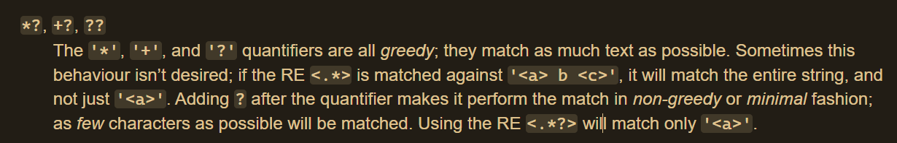

# 问题集

题目地址 ：https://cs50.harvard.edu/python/2022/psets/7/

# [NUMB3RS](https://cs50.harvard.edu/python/2022/psets/7/numb3rs/)

In Season 5, Episode 23 of [NUMB3RS](https://en.wikipedia.org/wiki/Numbers_(TV_series)), a supposed [IP address](https://en.wikipedia.org/wiki/IP_address) appears on screen, `275.3.6.28`, which isn't actually a valid [IPv4](https://en.wikipedia.org/wiki/IPv4) (or [IPv6](https://en.wikipedia.org/wiki/IPv6)) address.

An IPv4 address is a numeric identifier that a device (or, on TV, hacker) uses to communicate on the internet, akin to a postal address in the real world, typically formatted in [dot-decimal notation](https://en.wikipedia.org/wiki/Dot-decimal_notation) as `#.#.#.#`. But each `#` should be a number between `0` and `255`, inclusive. Suffice it to say `275` is not in that range! If only NUMB3RS had validated the address in that scene!

In a file called `numb3rs.py`, implement a function called `validate` that expects an IPv4 address as input as a `str` and then returns `True` or `False`, respectively, if that input is a valid IPv4 address or not.

Structure `numb3rs.py` as follows, wherein you're welcome to modify `main` and/or implement other functions as you see fit, but you may not import any other libraries. You're welcome, but not required, to use `re` and/or `sys`.

```python
import re
import sys

def main():
    print(validate(input("IPv4 Address: ")))

def validate(ip):
    ...

...

if __name__ == "__main__":
    main()

```

Either before or after you implement `validate` in `numb3rs.py`, additionally implement, in a file called `test_numb3rs.py`, **two or more** functions that collectively test your implementation of `validate` thoroughly, each of whose names should begin with `test_` so that you can execute your tests with:

```python
pytest test_numb3rs.py
```

Hints

- Recall that the `re` module comes with quite a few functions, per [docs.python.org/3/library/re.html](https://docs.python.org/3/library/re.html), including `search`.
- Recall that regular expressions support quite a few special characters, per [docs.python.org/3/library/re.html#regular-expression-syntax](https://docs.python.org/3/library/re.html#regular-expression-syntax).
- Because backslashes in regular expressions could be mistaken for escape sequences (like `\n`), best to use [Python's raw string notation for regular expression patterns](https://docs.python.org/3/library/re.html#module-re), else `pytest` will warn with `DeprecationWarning: invalid escape sequence`. Just as format strings are prefixed with `f`, so are raw strings prefixed with `r`. For instance, instead of `"harvard\.edu"`, use `r"harvard\.edu"`.
- Note that `re.search`, if passed a pattern with "capturing groups" (i.e., parentheses), returns a "match object," per [docs.python.org/3/library/re.html#match-objects](https://docs.python.org/3/library/re.html#match-objects), wherein matches are 1-indexed, which you can access individually with `group`, per [docs.python.org/3/library/re.html#re.Match.group](https://docs.python.org/3/library/re.html#re.Match.group), or collectively with `groups`, per [docs.python.org/3/library/re.html#re.Match.groups](https://docs.python.org/3/library/re.html#re.Match.groups).

[Demo](https://cs50.harvard.edu/python/2022/psets/7/numb3rs/#demo)
------------------------------------------------------------------

[Before You Begin](https://cs50.harvard.edu/python/2022/psets/7/numb3rs/#before-you-begin)
------------------------------------------------------------------------------------------

Log into [cs50.dev](https://cs50.dev/), click on your terminal window, and execute `cd` by itself. You should find that your terminal window's prompt resembles the below:

```
$

```

Next execute

```
mkdir numb3rs

```

to make a folder called `numb3rs` in your codespace.

Then execute

```
cd numb3rs

```

to change directories into that folder. You should now see your terminal prompt as `numb3rs/ $`. You can now execute

```
code numb3rs.py

```

to make a file called `numb3rs.py` where you'll write your program. Be sure to also execute

```
code test_numb3rs.py

```

to create a file called `test_numb3rs.py` where you'll write tests for your program.

[How to Test](https://cs50.harvard.edu/python/2022/psets/7/numb3rs/#how-to-test)
--------------------------------------------------------------------------------

#### [How to Test](https://cs50.harvard.edu/python/2022/psets/7/numb3rs/#how-to-test-numb3rspy) [`numb3rs.py`](https://cs50.harvard.edu/python/2022/psets/7/numb3rs/#how-to-test-numb3rspy)

Here's how to test `numb3rs.py` manually:

-   Run your program with `python numb3rs.py`. Ensure your program prompts you for an IPv4 address. Type `127.0.0.1`, followed by Enter. Your `validate` function should return `True`.-   Run your program with `python numb3rs.py`. Type `255.255.255.255`, followed by Enter. Your `validate` function should return `True`.-   Run your program with `python numb3rs.py`. Type `512.512.512.512`, followed by Enter. Your `validate` function should return `False`.-   Run your program with `python numb3rs.py`. Type `1.2.3.1000`, followed by Enter. Your `validate` function should return `False`.-   Run your program with `python numb3rs.py`. Type `cat`, followed by Enter. Your `validate` function should return `False`.

#### [How to Test](https://cs50.harvard.edu/python/2022/psets/7/numb3rs/#how-to-test-test_numb3rspy) [`test_numb3rs.py`](https://cs50.harvard.edu/python/2022/psets/7/numb3rs/#how-to-test-test_numb3rspy)

To test your tests, run `pytest test_numb3rs.py`. Try to use correct and incorrect versions of `numb3rs.py` to determine how well your tests spot errors:

-   Ensure you have a correct version of `numb3rs.py`. Run your tests by executing `pytest test_numb3rs.py`. `pytest` should show that all of your tests have passed.-   Modify the `validate` function in the correct version of `numb3rs.py`. `validate` might, for example, only check whether the first byte of the IPv4 address is valid. Run your tests by executing `pytest test_numb3rs.py`. `pytest` should show that at least one of your tests has failed.-   Again modify the correct version of `numb3rs.py`. `validate` might, for example, mistakenly return `True` when the user inputs an incorrect IPv4 format. Run your tests by executing `pytest test_numb3rs.py`. `pytest` should show that at least one of your tests has failed.

You can execute the below to check your code using `check50`, a program that CS50 will use to test your code when you submit. But be sure to test it yourself as well!

```
check50 cs50/problems/2022/python/numb3rs

```

Green smilies mean your program has passed a test! Red frownies will indicate your program output something unexpected. Visit the URL that `check50` outputs to see the input `check50` handed to your program, what output it expected, and what output your program actually gave.

[How to Submit](https://cs50.harvard.edu/python/2022/psets/7/numb3rs/#how-to-submit)
------------------------------------------------------------------------------------

In your terminal, execute the below to submit your work.

```bash
submit50 cs50/problems/2022/python/numb3rs
```

## 思路

```python
import re
import sys

def main():
    print(validate(input("IPv4 Address: ")))

def validate(ip):
    """
    共有三种情况：
    1位数，0-9
    2位数，10-99
    3位数，100-255 = 100-199 200-249 250-255
    匹配这三种情况的任意一种就可以
    127.0.0.1
    255.255.255.255
    512.512.512.512
    """
    pattern = r"^((\d|\d{2}|1\d{2}|2[0-4]\d|25[0-5])\.){3}(\d|\d{2}|1\d{2}|2[0-4]\d|25[0-5])$"
    return False if re.search(pattern, ip) is None else True

if __name__ == "__main__":
    main()
```

```python
# test_numb3rs.py
from numb3rs import validate

def test_normal():
    assert validate("127.0.0.1") == True

def test_corner_case():
    assert validate("255.255.255.255") == True

def test_invalid():
    assert validate("512.512.512.512") == False

def test_add():
    assert validate("2001:0db8:85a3:0000:0000:8a2e:0370:7334") == False

def test_add1():
    assert validate("cat") == False

def test_add2():
    assert validate("64.128.256.512") == False
```

# Watch on YouTube

It turns out that (most) YouTube videos can be embedded in other websites, just like the above. For instance, if you visit <https://youtu.be/xvFZjo5PgG0> on a laptop or desktop, click **Share**, and then click **Embed**, you'll see [HTML](https://en.wikipedia.org/wiki/HTML) (the language in which web pages are written) like the below, which you could then copy into your own website's source code, wherein [`iframe`](https://developer.mozilla.org/en-US/docs/Web/HTML/Element/iframe) is an HTML "element," and `src` is one of several HTML "attributes" therein, the value of which, between quotes, is `https://www.youtube.com/embed/xvFZjo5PgG0`.

```html
<iframe width="560" height="315" src="https://www.youtube.com/embed/xvFZjo5PgG0" title="YouTube video player" frameborder="0" allow="accelerometer; autoplay; clipboard-write; encrypted-media; gyroscope; picture-in-picture" allowfullscreen></iframe>
```

Because some HTML attributes are optional, you could instead minimally embed just the below.

```html
<iframe src="https://www.youtube.com/embed/xvFZjo5PgG0"></iframe>
```

Suppose that you'd like to extract the URLs of YouTube videos that are embedded in pages (e.g., `https://www.youtube.com/embed/xvFZjo5PgG0`), converting them back to shorter, shareable `youtu.be` URLs (e.g., `https://youtu.be/xvFZjo5PgG0`) where they can be watched on YouTube itself.

In a file called `watch.py`, implement a function called `parse` that expects a `str` of HTML as input, extracts any YouTube URL that's the value of a `src` attribute of an `iframe` element therein, and returns its shorter, shareable `youtu.be` equivalent as a `str`. Expect that any such URL will be in one of the formats below. Assume that the value of `src` will be surrounded by double quotes. And assume that the input will contain no more than one such URL. If the input does not contain any such URL at all, return `None`.

- `http://youtube.com/embed/xvFZjo5PgG0`
- `https://youtube.com/embed/xvFZjo5PgG0`
- `https://www.youtube.com/embed/xvFZjo5PgG0`

Structure `watch.py` as follows, wherein you're welcome to modify `main` and/or implement other functions as you see fit, but you may not import any other libraries. You're welcome, but not required, to use `re` and/or `sys`.

```python
import re
import sys

def main():
    print(parse(input("HTML: ")))

def parse(s):
    ...

...

if __name__ == "__main__":
    main()

```

**Hints**

-   Recall that the `re` module comes with quite a few functions, per [docs.python.org/3/library/re.html](https://docs.python.org/3/library/re.html), including `search`.-   Recall that regular expressions support quite a few special characters, per [docs.python.org/3/library/re.html#regular-expression-syntax](https://docs.python.org/3/library/re.html#regular-expression-syntax).-   Because backslashes in regular expressions could be mistaken for escape sequences (like `\n`), best to use [Python's raw string notation for regular expression patterns](https://docs.python.org/3/library/re.html#module-re). Just as format strings are prefixed with `f`, so are raw strings prefixed with `r`. For instance, instead of `"harvard\.edu"`, use `r"harvard\.edu"`.
- Note that `re.search`, if passed a pattern with "capturing groups" (i.e., parentheses), returns a "match object," per [docs.python.org/3/library/re.html#match-objects](https://docs.python.org/3/library/re.html#match-objects), wherein matches are 1-indexed, which you can access individually with `group`, per [docs.python.org/3/library/re.html#re.Match.group](https://docs.python.org/3/library/re.html#re.Match.group), or collectively with `groups`, per [docs.python.org/3/library/re.html#re.Match.groups](https://docs.python.org/3/library/re.html#re.Match.groups).
- Note that `*` and `+` are "greedy," insofar as "they match as much text as possible," per [docs.python.org/3/library/re.html#regular-expression-syntax](https://docs.python.org/3/library/re.html#regular-expression-syntax). Adding `?` immediately after either, a la `*?` or `+?`, "makes it perform the match in non-greedy or minimal fashion; as few characters as possible will be matched."

关于贪婪和非贪婪官方的解释如下：




[Demo](https://cs50.harvard.edu/python/2022/psets/7/watch/#demo)
----------------------------------------------------------------

[Before You Begin](https://cs50.harvard.edu/python/2022/psets/7/watch/#before-you-begin)
----------------------------------------------------------------------------------------

Log into [cs50.dev](https://cs50.dev/), click on your terminal window, and execute `cd` by itself. You should find that your terminal window's prompt resembles the below:

```
$

```

Next execute

```
mkdir watch

```

to make a folder called `watch` in your codespace.

Then execute

```
cd watch

```

to change directories into that folder. You should now see your terminal prompt as `watch/ $`. You can now execute

```
code watch.py

```

to make a file called `watch.py` where you'll write your program.

[How to Test](https://cs50.harvard.edu/python/2022/psets/7/watch/#how-to-test)
------------------------------------------------------------------------------

Here's how to test your code manually:

-   Run your program with `python watch.py`. Ensure your program prompts you for HTML, then copy/paste the below:
    ```
    <iframe src="http://www.youtube.com/embed/xvFZjo5PgG0"></iframe>

    ```

    Press enter and your program should output `https://youtu.be/xvFZjo5PgG0`. Notice how, though the `src` attribute is prefixed with `http://www.youtube.com/embed/`, the resulting link is prefixed with `https://youtu.be/`.

    -   Run your program with `python watch.py`. Ensure your program prompts you for HTML, then copy/paste the below:
    ```
    <iframe width="560" height="315" src="https://www.youtube.com/embed/xvFZjo5PgG0" title="YouTube video player" frameborder="0" allow="accelerometer; autoplay; clipboard-write; encrypted-media; gyroscope; picture-in-picture" allowfullscreen></iframe>

    ```

    Press enter and your program should still output `https://youtu.be/xvFZjo5PgG0`.

    -   Run your program with `python watch.py`. Ensure your program prompts you for HTML, then copy/paste the below:
    ```
    <iframe width="560" height="315" src="https://cs50.harvard.edu/python"></iframe>

    ```

    Press enter and your program should output `None`. Notice how the `src` attribute doesn't point to a YouTube link!

You can execute the below to check your code using `check50`, a program that CS50 will use to test your code when you submit. But be sure to test it yourself as well!

```
check50 cs50/problems/2022/python/watch

```

Green smilies mean your program has passed a test! Red frownies will indicate your program output something unexpected. Visit the URL that `check50` outputs to see the input `check50` handed to your program, what output it expected, and what output your program actually gave.

[How to Submit](https://cs50.harvard.edu/python/2022/psets/7/watch/#how-to-submit)
----------------------------------------------------------------------------------

In your terminal, execute the below to submit your work.

```
submit50 cs50/problems/2022/python/watch

```

## 思路

```python
"""
http://youtube.com/embed/xvFZjo5PgG0
https://youtube.com/embed/xvFZjo5PgG0
https://www.youtube.com/embed/xvFZjo5PgG0
"""
import re
import sys

def main():
    print(parse(input("HTML: ")))

def parse(s):
    """
    <iframe src="http://www.youtube.com/embed/xvFZjo5PgG0"></iframe>

    """
    pattern = r"\"https?://(w{3})?\.?youtube\.com/embed/(.*?)\""
    ans = re.search(pattern, s)
    
    return f"https://youtu.be/{ans.groups()[1]}" if ans is not None else None


if __name__ == "__main__":
    main()

```